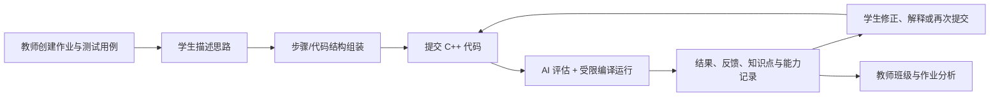
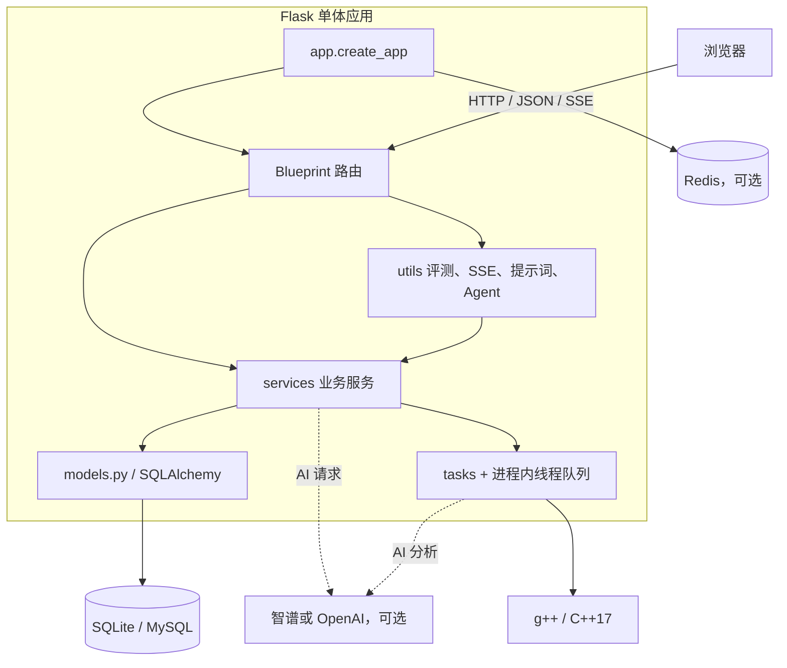

# CodeSense 项目理解（阶段一）

> 本文是对当前仓库实现的维护者视角梳理，目标是建立后续开发、评审和部署前排查的共同上下文。
>
> 观察基线：`main` 分支 HEAD `950c233`（2026-09-06，提交 `chore: harden codesense systemd services`）。本阶段只新增文档，不修改业务代码、数据库模型或运行逻辑。

## 1. 文档范围与结论口径

本文结论主要来自以下入口和实现（阅读范围）：

- 应用装配：`app.py`、`config.py`、`run.py`、`wsgi.py`、`gunicorn_config.py`；
- 数据模型：`models.py`；
- HTTP 路由：`routes/` 下的认证、作业、用户、班级、API、三阶段学习和成绩路由；
- 业务服务与后台任务：`services/`、`tasks/`；
- 代码评测、SSE、提示词和阶段三 Agent：`utils/`；
- 运行与容量说明：`README.md`、`README.en.md`、`PERFORMANCE_CAPACITY.md`、`DEPLOYMENT.md`、`CHANGELOG.md`；
- 回归测试：`tests/`。

### 1.1 使用的 AI 工具与协作方式

本次梳理与文档撰写在 Trae IDE 中完成，使用模型 `GLM-5.2` 作为辅助 Agent。具体用法：

- 通过语义检索/文件读取工具阅读仓库代码、配置和已有文档；
- 通过 PowerShell 终端执行 `git`、`python -m compileall`、版本与依赖检查命令并记录输出；
- 所有事实性结论以代码或命令输出为准；模型仅负责汇总、归类和措辞，不替代码或命令的结果做判断；
- 未在写作过程中调用任何外部 LLM provider API（智谱/OpenAI 均未触发）。

### 1.2 结论口径

文中使用“已确认”表示可以直接从当前代码或配置读到；使用“推断”表示根据调用关系得到的架构判断；使用“未知/待验证”表示仓库本身没有足够证据，需要在目标部署环境或后续需求中确认。

## 2. 一句话结论

CodeSense 是一个以 Flask 单体应用为核心的高校编程教学平台：学生提交 C++ 作业后，系统进行受限编译运行、AI 反馈和学习记录；学生还可以通过“思路描述 → 步骤组装 → 费曼教学”的三阶段流程完成引导式练习；教师通过作业、班级、花名册、提交记录和能力分析页面观察学习情况。

它目前不是拆分后的微服务系统，而是“Flask 路由 + SQLAlchemy 模型 + 业务服务 + 异步任务 + 外部数据库/Redis/LLM”的组合。评测和 AI 功能已经有一定容错设计。任务系统存在两种形态（已确认）：**默认配置**下异步任务在 Web 进程内以线程运行，C++ 编译执行也发生在 Web 进程所在主机；代码同时内置了**可选的 RQ 外部队列形态**——`config.py` 暴露队列后端开关，仓库提供独立 worker 进程（`tasks/submission_worker.py`、`tasks/ability_worker.py`）和对应的 systemd 单元，启用后提交评测（含 C++ 编译运行）移出 Web 进程。该形态默认不启用，且即使启用，沙箱仍是应用层 subprocess 而非强隔离。因此部署时最需要优先确认的是：生产采用哪种队列形态、worker 是否独立部署、以及代码执行节点的隔离边界。

## 3. 项目概况

### 3.1 产品边界

| 使用者 | 核心能力 | 主要状态数据 |
| --- | --- | --- |
| 学生 | 登录、浏览作业、提交 C++、查看评测与反馈、完成三阶段引导、查看个人学习画像 | `User`、`Submission`、`ThinkingSession`、`ThinkingStageLog`、`KnowledgePointScore`、`AbilityTrend` |
| 教师 | 创建/编辑作业、维护班级与花名册、查看提交和班级统计、生成学情建议 | `Assignment`、`TestCase`、`Class`、`StudentRoster`、`TeacherAISuggestion` |
| 管理员 | 用户、系统设置、全局成绩与数据导出等管理能力 | `SystemLog`、`SystemConfig` 及上述业务数据 |
| 访客 | 通过公开入口体验学生或教师演示流程 | 当前浏览器会话对应的临时 SQLite 数据库 |

### 3.2 核心学习闭环



这里有三种不同的“得分/状态”需要分开理解：作业提交得分持久化为 0–5；阶段一思路匹配度使用 0–100；知识点和能力画像也使用 0–100。提交评测最终以沙箱测试结果为主，AI 反馈承担解释和辅导作用。

## 4. 运行时架构



### 4.1 应用装配顺序

`app.py` 在导入时创建全局 `app`，`create_app()` 负责：

1. 根据 `FLASK_CONFIG` 加载 development/testing/production 配置；
2. 配置反向代理头、数据库 engine 及连接池参数；
3. 优先连接 Redis 作为 Flask-Session 后端，失败时降级到文件会话；
4. 初始化 Flask-SQLAlchemy、Flask-Session、Flask-Login；
5. 注册 `auth`、`main`、`assignments`、`users`、`api`、`classes`、`thinking`、`grades` 八个 Blueprint；
6. 注册 `/healthz` 和 `/readyz`；
7. 开发/测试模式按配置执行 `db.create_all()`、历史列兼容处理和索引维护；生产模式默认要求先执行 `database_maintenance.py`；
8. 清理过期公开体验临时库，并按配置启动进程内异步任务系统。

因此，导入 `app` 不是纯粹的静态对象加载，可能触发数据库连接、Redis 探测、日志初始化、临时体验清理和后台线程启动。测试、Gunicorn worker 和一次性维护命令都需要考虑这个副作用。

## 5. 代码结构

### 5.1 根目录入口与配置

| 路径 | 作用 | 备注 |
| --- | --- | --- |
| `app.py` | Flask 应用工厂、扩展初始化、Blueprint 注册、健康检查和全局请求钩子 | 当前实际装配中心 |
| `config.py` | development/testing/production 配置 | 生产要求 `DATABASE_URL` 和 `SECRET_KEY` |
| `run.py` | 开发启动包装器 | 导入 `app` 后监听 `0.0.0.0:5000` |
| `wsgi.py` | WSGI 入口 | 默认将 `FLASK_CONFIG` 设为 production，导出对象名为 `application` |
| `gunicorn_config.py` | Gunicorn 运行参数 | 默认 2 worker、每 worker 4 threads，绑定 `127.0.0.1:5000` |
| `database_maintenance.py` | 生产部署前的一次性建表、补列和索引维护 | 不启动 Web 服务和后台 AI 任务 |
| `.env.example` | 环境变量模板 | 包含数据库、AI、连接池、进程内任务和安全参数；**当前未收录 `REDIS_URL` 与 RQ 外部队列相关变量（已确认）**，启用外部队列时需手动补齐 |
| `requirements.txt` | Python 依赖锁定/范围声明 | Flask、SQLAlchemy、AI SDK、Redis、数据导入导出等；RQ 后端另需固定版本的 `rq` 依赖 |
| `requirements-test.txt` | 测试依赖声明 | pytest 等回归测试所需依赖 |
| `forms.py` | WTForms 表单定义 | 登录、注册、作业等表单的服务端校验 |
| `deploy.sh`、`update.sh` | 部署/更新辅助脚本 | 服务器侧拉取、依赖安装与服务重启的封装 |
| `codesense.service` | Web 服务 systemd 单元 | 以 `codesense` 用户运行 Gunicorn，含 `NoNewPrivileges`、`ProtectSystem=strict`、`PrivateTmp` 等硬化；`ExecStart` 显式 `--bind 127.0.0.1:8000` |
| `codesense-submission-worker.service`、`codesense-ability-worker.service` | RQ worker 的 systemd 单元 | 分别运行 `python -m tasks.submission_worker`、`python -m tasks.ability_worker`；硬化配置与 Web 单元同级，`ReadWritePaths` 白名单限定可写目录 |

### 5.2 路由层

路由层采用 Flask Blueprint。页面通常由 Jinja 模板渲染，交互型功能通过 JSON 接口或 SSE 增量返回。

| 模块 | 主要职责 | 代表入口 |
| --- | --- | --- |
| `routes/auth.py` | 登录、注册、教师邀请、登出、公开体验入口 | `/login`、`/register`、`/demo-login/<role>` |
| `routes/main.py` | 首页、学生/教师/管理员仪表盘、个人资料、导出、系统设置 | `/home`、`/teacher_dashboard`、`/admin_dashboard` |
| `routes/assignments.py` | 作业 CRUD、作业分配、学生作业列表、提交页面、提交历史 | `/assignments`、`/submit/<assignment_id>` |
| `routes/users.py` | 用户管理、学生/教师详情、头像、密码、能力分析刷新 | `/users`、`/view_student_details/<student_id>` |
| `routes/classes.py` | 班级绑定、教师邀请码、花名册导入、班级统计 | `/classes/`、`/classes/<id>/import-students` |
| `routes/grades.py` | 成绩统计与 Excel 导出 | `/grades`、`/grades/export` |
| `routes/api.py` | 作业/提交查询、代码提交 API、AI 指导、代码建议、趋势和测试用例 API | `/api/submit`、`/api/code_advice` |
| `routes/thinking.py` | 三阶段引导、SSE 对话、阶段三双 Agent、会话恢复和开发追踪 | `/thinking/<assignment_id>`、`/thinking/api/stage1/*`、`/thinking/api/stage3/*` |

权限主要在路由层通过 Flask-Login、`login_required` 和角色/班级检查实现；模型层本身不是独立的授权边界。新增 API 时需要同时核对“是否登录”“是否属于该学生/班级”“是否允许教师或管理员操作”。

### 5.3 数据模型

所有模型集中在 `models.py`，当前没有独立的 `models/` 包。

| 分组 | 关键模型 | 关系要点 |
| --- | --- | --- |
| 身份与组织 | `User`、`Class`、`StudentRoster`、`InviteToken` | `User.usertype` 区分学生/教师/管理员；班级同时保留 `class_id` 和历史兼容的 `class_name` |
| 作业与评测 | `Assignment`、`TestCase`、`Submission` | 作业拥有测试用例和提交；提交保存 AI 反馈、沙箱状态、通过数和明细 JSON |
| 学习记录 | `ThinkingSession`、`ThinkingStageLog`、`StudentQuestion`、`CodeAdviceRequest` | 记录阶段状态、对话/提示/步骤事件及代码快照 |
| 学习分析 | `KnowledgePointScore`、`AssignmentKnowledgePoint`、`AbilityTrend` | 知识点从作业或 AI 检测得到，能力分析保存 Markdown/状态 |
| 教学分析 | `TeacherAISuggestion`、`SystemLog`、`SystemConfig` | 保存班级 AI 建议、审计日志和站点配置 |
| 阶段三预设 | `AssignmentThinkingPreset` | 保存参考代码、关键步骤、代码块、题目和难度配置等 JSON/文本 |

模型末尾集中声明性能索引，并由开发启动或 `database_maintenance.py` 检查创建。数据库结构兼容目前通过 `init_db()` 中的 `create_all()`、缺列检测和 `ALTER TABLE` 实现，仓库中未见一套独立的迁移版本目录；这使生产变更需要更谨慎地验证。

### 5.4 服务、任务与工具

| 目录/文件 | 作用 |
| --- | --- |
| `services/llm_client.py` | 共享 LLM 客户端；provider 选择、有限重试、熔断、并发上限、Redis/本地缓存和 single-flight 去重 |
| `services/ai_evaluator.py` | 代码评估、作业文本格式化、能力趋势、知识点检测等 AI 业务封装 |
| `services/course_grading.py` | 将正式提交与引导式学习证据组合为课程成绩/成绩册数据 |
| `services/teacher_analytics.py` | 班级提交趋势、作业完成矩阵、学生风险标签和教师首页数据 |
| `services/teacher_ai_advisor.py` | 班级薄弱点、重点学生和推荐练习的 AI/规则建议 |
| `services/demo_database.py` | 创建、激活、销毁和清理每个公开体验会话的临时 SQLite 库 |
| `services/demo_experience.py` | 向已激活的临时库幂等填充学生/教师演示数据、作业、历史提交和预设 |
| `tasks/submission_tasks.py` | 提交后的 AI 评估、C++ 测试、统计刷新、知识点评分和能力分析触发 |
| `tasks/ability_analysis.py` | 按学生和 demo run 去重的异步能力趋势生成 |
| `tasks/submission_queue.py`、`tasks/ability_queue.py` | 线程与 RQ 外部队列之间的分发：入队、作业状态查询、入队锁和 RQ 不可用时的失败标记；demo run 始终不进入外部队列 |
| `tasks/submission_worker.py`、`tasks/ability_worker.py` | 独立 RQ worker 进程入口；启动时关闭进程内任务与预设扫描（`ASYNC_TASKS_ENABLED=0`、`PRESET_SCAN_ENABLED=0`），并校验对应后端必须为 `rq`，否则以退出码 2 终止 |
| `utils/async_tasks.py` | 进程内有界队列和后台线程，处理能力趋势、批量趋势和阶段预设任务 |
| `utils/sandbox_runner.py` | 查找 g++、C++17 编译、逐用例运行、超时和输出规范化 |
| `utils/code_evaluator.py`、`utils/llm_evaluator.py` | 评测结果与 AI/启发式反馈的兼容层 |
| `utils/sse.py` | SSE 响应包装和阻塞函数的流式事件封装 |
| `utils/thinking_ai.py` | 阶段一/二提示、陪伴式对话和输出过滤辅助 |
| `utils/agents/` | 阶段三 Agent 合约、事件记忆、意图、目标、覆盖度、工具注册和双角色运行时 |

前端没有独立构建工程：`templates/` 保存 Jinja 页面和组件，`static/` 保存 CSS、原生 JavaScript、编辑器、SSE 客户端、图表和图片资源。

## 6. 关键流程

### 6.1 开发启动与生产启动

**开发路径：**

```text
python run.py
  -> 导入 app.py 的全局 app
  -> 默认 development 配置
  -> 默认 SQLite（除非设置 DATABASE_URL/DEV_DATABASE_URL）
  -> 按配置建表、补历史列、建索引
  -> 初始化会话、Blueprint 和进程内任务
  -> Flask 开发服务器 :5000
```

**生产路径：**

```text
python database_maintenance.py
  -> FLASK_CONFIG=production、关闭启动期任务
  -> 使用 DATABASE_URL 完成一次性表结构/索引维护

gunicorn -c gunicorn_config.py wsgi:application
  -> wsgi.py 默认 production
  -> 每个 worker 独立初始化数据库连接、Redis 客户端和 AI 客户端
  -> 通常由 Nginx 终止 HTTPS，再转发到本机 Gunicorn

# 可选：启用 RQ 外部队列时（两个 *_QUEUE_BACKEND=rq），另起独立 worker 进程
python -m tasks.submission_worker
python -m tasks.ability_worker
  -> worker 读 CODESENSE_CONFIG（默认 production）并转设 FLASK_CONFIG
  -> 启动时强制关闭进程内任务与预设扫描，避免与 Web 进程重复消费
  -> 仓库提供 codesense-submission-worker.service / codesense-ability-worker.service
  -> demo 公开体验始终走临时库线程路径，不进入外部队列
```

部署后应先检查 `/healthz`（不访问数据库的存活检查）和 `/readyz`（执行 `SELECT 1` 的数据库就绪检查）。

> 端口与入口口径差异（已确认，需在部署时核对）：`run.py` 默认监听 `0.0.0.0:5000`，`gunicorn_config.py` 默认 `bind = 127.0.0.1:5000`，而 `codesense.service` 的 `ExecStart` 通过命令行 `--bind 127.0.0.1:8000` 覆盖配置文件，`.env.example` 中 `PORT=8000`。实际对外口径以 systemd 单元和 Nginx upstream 为准；Web 单元使用 `app:app`，worker 单元不监听端口。

### 6.2 登录、会话与单点登录

普通登录将用户交给 Flask-Login，并在数据库与会话中保存当前 session id。`app.py` 的请求前钩子会在业务查询前检查当前 session id 是否仍与用户记录一致；发现其他地方登录后，旧会话会被强制退出。

公开体验则走另一条路径：`/demo-login/<role>` 先创建随机 run id 对应的临时 SQLite 文件，再激活该数据库、填充演示数据并登录临时用户。后续请求根据 session 中的 run id 在 Flask-Login/业务查询前切换 SQLAlchemy scoped session；登出或过期清理时销毁该临时库。设计目标是让演示写入不进入正式库，且临时会话失效时绝不回退查询正式库。

### 6.3 学生提交与评测

```text
POST /submit/<assignment_id> 或 /api/submit
  -> 校验登录身份、作业和代码长度
  -> 创建 Submission(status=pending)
  -> 触发 evaluate_submission_async
  -> evaluate_cpp_code：生成 AI/启发式分数与反馈
  -> run_test_cases：g++ -std=c++17 -O2 -Wall，逐测试用例运行
  -> 保存 sandbox_status、通过数、总数和 JSON 明细
  -> 以沙箱通过比例折算 0–5 提交分数
  -> 刷新作业和用户汇总统计
  -> 更新作业关联知识点/学生知识点分数
  -> 标记能力分析过期并触发异步能力分析
  -> 正式账户写入系统日志；公开体验只写入当前临时库
```

`routes/assignments.py` 负责页面提交并跳转到评测等待页；`routes/api.py` 提供 API 形式的提交和状态查询。评测任务会把 demo run id 一路传递到后台线程，并在关键写入前再次确认临时库仍然有效。

沙箱当前明确实现了：编译 15 秒超时、单用例运行 5 秒超时、标准输出截断到 4096 字符、换行/行尾空白规范化、临时工作目录和用例级结果。它没有实现操作系统级的权限、网络、文件系统、内存或进程数隔离。

### 6.4 三阶段引导式学习

1. **阶段一：思路描述**
   - `ThinkingSession` 绑定学生和作业；
   - `/thinking/api/stage1/submit` 根据 `AssignmentThinkingPreset.key_steps` 评估自然语言描述；
   - 得分达到阈值后推进到阶段二，并写入 `ThinkingStageLog`；
   - `/stage1/hint` 可通过 JSON 或 SSE 请求提示，提示结果经过 `sanitize_response`。

2. **阶段二：步骤/积木组装**
   - 前端提交选择/填空答案；
   - 服务端先做规范化字符串比较，再通过 `check_quiz_equivalence` 判断合理等价答案；
   - 通过后保存步骤状态，推进到阶段三并生成初始问题；失败则记录错误步骤和解释。

3. **阶段三：费曼教学**
   - 传统入口 `/stage3/chat` 和 `/stage3/teach` 分别使用教师 Agent、学生 Agent；
   - 论坛入口 `/stage3/forum/message` 要求显式目标角色；
   - `DualFeynmanRuntime` 使用事件记忆、状态归约、覆盖度/目标判定和工具注册，控制追问、代码生成、修复评估和完成条件；
   - `/stage3/write_code` 生成带陷阱的尝试，`/stage3/fix_code` 评估学生修复；
   - `/complete_session` 只有在服务端确认阶段三完成条件后才允许完成，并可在演示场景生成临时五分制提交。

三阶段的前端交互同时支持普通 JSON 和 SSE。SSE 主要解决 AI 首 token 和增量文本展示问题，不改变最终业务状态仍由服务端落库的事实。

### 6.5 能力分析与教师视图

提交完成后会将 `AbilityTrend` 标记为过期，再由 `tasks/ability_analysis.py` 读取最近提交，调用统一 LLM 客户端生成分析 Markdown；失败时明确记录 failed 状态，不应继续展示陈旧的成功文案。教师首页由 `teacher_analytics.py` 聚合学生活跃度、提交数、作业完成矩阵和风险标签，教师 AI 建议由 `teacher_ai_advisor.py` 异步生成并保存。

`utils/async_tasks.py` 另有一个进程内有界队列，当前支持能力趋势、批量趋势和思维预设生成。它与提交评测/能力分析中的直接线程不是同一个统一任务系统。

> 关于外部队列的可选后端（已确认）：`config.py` 暴露了 `ABILITY_ANALYSIS_QUEUE_BACKEND` 与 `SUBMISSION_EVALUATION_QUEUE_BACKEND` 两个开关，默认 `thread`，可切换为基于 Redis 的外部队列（`ABILITY_ANALYSIS_REDIS_URL`、`SUBMISSION_EVALUATION_REDIS_URL`、对应 `*_QUEUE_NAME`、`*_JOB_TIMEOUT`、`*_QUEUE_TTL`、`*_RESULT_TTL`、`*_FAILURE_TTL`）。`tasks/ability_queue.py` 与 `tasks/submission_queue.py` 负责线程与外部队列之间的分发。Demo run 始终使用临时数据库的线程路径，不走外部队列。外部队列的消费侧是两个独立进程 `tasks/submission_worker.py` 与 `tasks/ability_worker.py`（RQ `Worker`，JSON 序列化），仓库提供对应的 systemd 单元；worker 进程启动时主动关闭进程内任务线程与预设扫描，避免与 Web 进程重复消费。这是当前主线相对早期“纯进程内任务”描述的重要更新；但后端开关默认为 `thread`，不配置 `rq`、不部署 worker 时，系统行为仍与纯进程内形态一致。

## 7. 运行方式

### 7.1 本地开发

环境要求：Python 3.8+、可选 Redis、C++ 评测所需的 `g++`，以及 AI 功能所需的智谱或 OpenAI API Key。

```powershell
python -m venv .venv
.venv\Scripts\Activate.ps1
python -m pip install -r requirements.txt
Copy-Item .env.example .env
python run.py
```

默认打开 <http://127.0.0.1:5000/login>。开发环境没有配置 `DATABASE_URL` 时使用 SQLite；Redis 不可用时会话和部分缓存降级到文件/进程内实现；没有 AI Key 时基础页面和非 AI 功能仍可检查，但 AI 相关功能会失败或不可用。

### 7.2 测试

```powershell
python -m pytest tests -q
```

测试同时使用 pytest 和 unittest 风格。涉及 C++ 评测的用例需要 `g++`；涉及真实 provider 的用例需要对应环境配置，单元测试通常通过 mock 隔离外部 AI 服务。当前仓库未看到明确的 CI 工作流，因此本地回归结果不能自动等同于 GitHub Checks 结果。

### 7.3 生产

生产环境至少需要：

1. 设置随机且足够长的 `SECRET_KEY`；
2. 设置独立的 `DATABASE_URL`，并先执行 `python database_maintenance.py`；
3. 线上 HTTPS 打开 `SECURE_COOKIES=true`，Nginx 反向代理场景配置 `TRUST_PROXY_HEADERS=true` 并核对代理层数；
4. 配置 Redis 会话/缓存或确认文件会话目录具备隔离、持久化和清理策略；
5. 安装 `g++`，并为代码执行节点建立额外隔离；
6. 通过 `gunicorn -c gunicorn_config.py wsgi:application` 启动（或使用 `codesense.service`），再由 Nginx 或其他反向代理对外提供服务；注意 systemd 单元的 `--bind 127.0.0.1:8000` 与配置文件默认 5000 端口径不同，Nginx upstream 需与实际监听端口一致；
7. 若启用 RQ 外部队列（两个 `*_QUEUE_BACKEND=rq`）：在 `.env` 中补齐 `*_REDIS_URL` 等队列变量（`.env.example` 当前未收录），安装 `rq` 依赖，并独立部署/启用 `codesense-submission-worker.service` 与 `codesense-ability-worker.service`；worker 通过 `CODESENSE_CONFIG` 读取环境名（默认 production）；不启用时保持默认 `thread` 即可，无需 worker 进程；
8. 持续监控 CPU、内存、数据库连接、任务队列（线程队列深度或 RQ 队列堆积）、AI provider 配额、临时文件和日志磁盘。

### 7.4 本次接管环境实测记录

以下是 2026-09-06 在当前工作区的实际尝试，不代表目标生产环境结论：

| 尝试 | 结果 |
| --- | --- |
| `git clone https://github.com/XiaoCow666/CodeSense.git .` | 通过；2956 objects，28.29 MiB（绕过本地代理后） |
| `git log -1 --pretty='%H %ci %s'` | 通过；输出 `950c233c8ff5c6ae8478bff0c64ed20c45e1f9a1 2026-09-06 13:39:26 +0800 chore: harden codesense systemd services` |
| `(Get-Command python).Source` | 通过；输出 `D:\Python311\python.exe` |
| `python --version` | 通过；输出 `Python 3.11.9` |
| `python -m pytest --version` | 失败：`No module named pytest`（依赖未安装，无法运行回归） |
| `(Get-Command g++).Source` | 失败：`g++ not found on PATH`；无法验证 C++ 沙箱真实编译运行 |
| `python -m compileall -q app.py config.py run.py wsgi.py database_maintenance.py` | 通过，退出码 `0`；仅语法检查，不等价于应用启动或功能回归 |
| 文档修订轮（同日，静态核查） | 按工作约束**未执行任何终端、git 或沙箱命令**；结论全部来自逐文件只读核对。本轮新确认：RQ 独立 worker 与三个 systemd 单元已在仓库中；`.env.example` 未收录 `REDIS_URL` 与队列变量；`codesense.service` 监听 8000 而 `gunicorn_config.py`/`run.py` 默认 5000 |

本次未创建 `.env`、未填入任何密钥、未连接正式数据库、未运行 `requirements.txt` 安装。要完成可运行验证，仍需要：在当前 Python 3.11.9 环境中安装 `requirements.txt` 与 `pytest`、提供 `g++`、按环境选择 SQLite/MySQL、可选 Redis 以及 AI provider 配置。

> 历史记录：2026-09-03 在另一工作区曾尝试运行 `python`，但当时 PATH 中没有 `python`，结论与本次不同。该次记录已随仓库历史归档，不再作为本次 PR 的事实依据。

## 8. 风险清单

| 优先级 | 风险 | 影响 | 当前缓解/后续方向 |
| --- | --- | --- | --- |
| 高 | C++ 沙箱是应用层 subprocess 限制，不是强隔离 | 恶意代码可能利用宿主机权限、文件、网络或资源；公网开放存在高风险 | 上线前增加容器/虚拟机、低权限用户、网络禁用、CPU/内存/进程/磁盘配额，并单独部署评测 worker |
| 高（默认形态）/中（启用 RQ 后） | 后台任务默认在 Web 进程内以线程运行 | 默认 `thread` 后端下，重启可能丢任务；多 worker 各自拥有队列、线程、缓存和去重状态，可能重复执行或任务不可见 | 仓库已内置可选 RQ 持久化队列与独立 worker 进程（含 systemd 单元）：启用两个 `*_QUEUE_BACKEND=rq`、部署 worker 后，评测与能力分析移出 Web 进程，风险显著降低；仍需补充幂等键、重试/死信监控和队列堆积告警。demo 公开体验按设计始终走线程路径 |
| 高 | AI 输出和 AI 生成预设不是确定性事实 | 评分、提示、能力画像和阶段三判定可能受 provider、提示注入、上下文截断或模型升级影响 | 保留沙箱作为程序事实来源；固定评测协议和模型版本；增加人工复核、敏感数据脱敏、提示注入测试和结果审计 |
| 高 | 学生代码、对话、代码快照和 AI 结果包含学习隐私 | 数据库、日志、Redis、LLM provider 和导出文件都可能成为数据泄露面 | 明确数据保留/删除策略，限制日志内容和导出权限，生产密钥与数据库分离，核对第三方 AI 数据处理政策 |
| 中 | 数据库结构演进依赖 `create_all`、补列和索引检查 | 复杂变更、回滚和多版本并行发布缺少清晰迁移轨迹 | 建立版本化迁移、备份/恢复演练和生产前升级验证；不要把启动期自动维护当成完整迁移方案 |
| 中 | 授权逻辑分散在路由与查询组合中 | 新增 API 可能只做登录检查而漏掉对象归属、班级范围或角色边界 | 抽取可复用的角色/资源授权函数，补充越权矩阵测试 |
| 中 | 公开体验使用临时 SQLite 与后台线程交互 | 浏览器退出、文件锁、worker 生命周期和清理时序可能造成残留或失败 | 保持 run id 显式传递；在多进程环境验证锁和清理；为失败清理提供告警和定期维护 |
| 中 | 观测以日志和轻量探针为主 | 任务延迟、AI 首 token、熔断、队列堆积和沙箱资源消耗缺少完整指标 | 接入结构化指标、trace/request id、任务状态面板和 provider 用量监控 |
| 低 | 运行参数口径存在已确认的不一致 | `gunicorn_config.py` 默认 bind 5000，`codesense.service` 命令行覆盖为 8000，`.env.example` 为 `PORT=8000`，`run.py` 默认 5000；`.env.example` 未收录 `REDIS_URL` 与 RQ 队列变量；Web 用 `FLASK_CONFIG`、worker 用 `CODESENSE_CONFIG` | 开发者可能使用错误端口、WSGI 入口或环境变量名。以 systemd 单元、`wsgi.py`、worker 脚本和实际 `.env` 为准；后续统一 README、`.env.example`、脚本和运维配置 |

## 9. 未知项与下一步核对项

以下问题无法只通过当前代码确定，适合在阶段二或部署评审中补齐：

| 问题 | 为什么未知 | 建议验证方式 |
| --- | --- | --- |
| 目标生产环境的 Nginx、HTTPS、进程管理和备份拓扑 | 仓库只提供应用侧配置，不能代表真实服务器 | 获取部署清单，验证 forwarded headers、Cookie、超时和优雅退出 |
| 生产是否启用 RQ 后端、worker 单元是否已部署、Nginx upstream 用 8000 还是 5000 | 队列开关默认 `thread`，`.env.example` 未收录队列变量，systemd 与 gunicorn 配置端口不一致 | 在部署清单中确认两个 `*_QUEUE_BACKEND`、`*_REDIS_URL`、`CODESENSE_CONFIG`、worker 服务启用状态和 Nginx upstream 端口；启用 RQ 后做一次 worker 重启与 Redis 断连演练 |
| 实际使用的数据库类型、版本、字符集和迁移历史 | 代码同时支持 SQLite/MySQL，历史库结构未随仓库提供 | 对脱敏数据库执行维护命令和升级演练，记录耗时与回滚方案 |
| AI provider、模型版本、限额和数据留存策略 | 配置可选，provider 行为由外部服务决定 | 建立 provider 配置表、脱敏请求样本、限流/失败演练和成本上限 |
| C++ 评测是否允许公网用户触发 | 代码提供公开体验和代码执行，但部署访问范围不在仓库内 | 在网络边界文档中明确“课程内受控”还是“公网可用”，并按威胁模型验收沙箱 |
| 多 worker 下临时库绑定、会话、Redis 和后台任务的完整行为 | 单进程测试不能覆盖跨进程时序 | 用至少 2 个 worker 做并发登录、提交、登出、过期清理和 worker 重启测试 |
| 真实数据规模与查询容量 | 仅有估算报告，没有可复现的目标数据集和压测脚本 | 用脱敏数据压测登录、作业列表、提交状态、班级统计和 AI/SSE 峰值 |
| 成绩策略是否继续采用 0–5、知识点/能力采用 0–100 | 当前实现和 README 已采用该口径，但产品/教学规则可能变化 | 与课程负责人确认规则，并将规则写成可测试的策略文档 |
| 是否需要 CI、自动安全扫描和依赖更新策略 | 仓库未见明确 CI 工作流 | 确定 GitHub Actions、Python 版本矩阵、测试分层和依赖漏洞处理责任 |

## 10. 阶段一结论与非目标

### 已形成的理解

- 这是一个以 Flask 单体为中心的教学平台，核心状态在 SQLAlchemy 模型中；
- 学生主链路由引导式学习、代码提交、C++ 受限执行、AI 反馈和能力分析共同构成；
- 阶段三已经从单纯文本对话扩展为带事件记忆、工具、覆盖度和完成条件的双 Agent 运行时；
- 公开体验通过临时数据库和显式 run id 做业务数据隔离；
- 异步任务存在“进程内线程（默认）”与“RQ 外部队列 + 独立 worker 进程（可选）”两种形态，后者已随代码和 systemd 单元提供，但开关默认 `thread`、不自动启用；
- 当前小规模课堂/演示是较符合实现边界的使用场景，正式公网部署前必须优先补强沙箱隔离，并明确生产采用哪种队列形态。

### 本阶段明确不做

- 不修改业务逻辑、路由行为、模型字段、提示词或前端交互；
- 不改变数据库结构、运行参数或部署脚本；
- 不把本文中的推断当成生产承诺；
- 不用文档替代安全评审、压测、迁移演练或真实环境验收。

后续修改应以本文的模块边界和未知项为检查清单，先补可验证的测试/运行证据，再进入业务代码变更。

## 11. 本次文档 PR 状态与协作请求

### 11.1 PR 元信息

- 目标仓库：`XiaoCow666/CodeSense`
- 目标分支：`main`
- PR 来源分支：`docs/project-understanding-v2`（账号 `linxi123-A`）
- 实际推送路径（已确认）：直接推送上游 `XiaoCow666/CodeSense` 返回 HTTP 403（该账号无上游写权限），改为推送到 fork `linxi123-A/CodeSense`，以跨仓库 PR 提交（head：`linxi123-A:docs/project-understanding-v2` → base：`XiaoCow666:main`）
- PR 链接：https://github.com/XiaoCow666/CodeSense/pull/16
- 改动范围：仅新增/更新 `PROJECT_UNDERSTANDING.md` 一个文档文件，不修改业务代码、数据库模型、配置、部署脚本或前端资源。

### 11.2 与上一轮尝试的关系

仓库历史上曾存在一次同主题文档尝试，使用账号 `ggboyxkw666` 推送 `docs/project-understanding` 时返回 `remote: Permission to XiaoCow666/CodeSense.git denied`（HTTP `403`）。本次为重新组织的 PR，使用账号 `linxi123-A` 重新建立分支、重写实测记录并补齐本节，不沿用上一次的远程分支与提交。

### 11.3 请求项目负责人评审

请 @XiaoCow666 作为项目负责人评审本 PR，重点关注：

1. 第 2、3、4 节的项目定位、运行时架构与代码结构是否符合当前主线方向；
2. 第 6 节关键流程描述与实际实现是否一致，尤其是阶段三双 Agent、临时数据库隔离与提交评测链路；
3. 第 7.4 节实测记录是否需要在 CI 环境中追加验证；
4. 第 8 节风险清单中标注为“高”的项（C++ 沙箱非强隔离、进程内任务、AI 不确定性、学习隐私）是否与项目路线图对齐；
5. 第 9 节未知项是否需要在合并前补齐证据，或可在后续 issue 跟进。

如评审过程中发现事实性错误，请直接在对应行下方评论，本 PR 在评审通过前不进行业务代码改动。
