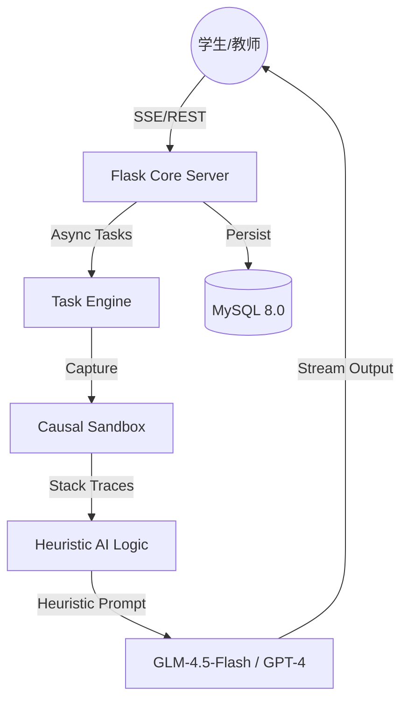

<div align="center">

# CodeSense 酷森思

**基于因果隔离沙箱与启发式大模型的智能编程教育实训平台**

[](https://github.com/XiaoCow666/CodeSense)
[](https://python.org)
[](https://flask.palletsprojects.com)
[](https://mysql.com)
[](LICENSE)

</div>

---

## 项目简介

CodeSense 酷森思是专为高校编程实训设计的**智能化评测与教学管理平台**。我们致力于解决传统 OJ（Online Judge）“只断对错，不教逻辑”的痛点，通过 AI 语义分析与动态沙箱执行的双轨驱动，打造“练-评-管”闭环 of 深度学习体验。

平台核心定位为**“启发式编程导师”**：它不直接向学生提供现成代码，而是通过对程序运行细节的捕捉和代码语义的深度理解，以引导、提问、类比的方式帮助学生自主修复 Bug，构建底层编程思维。

平台最新推出的 **“三阶段引导式学习竞技场 (Guided Learning Arena)”** 首创双大模型 Agent 联动教学模式，通过“思路描述-积木选择-费曼教学”三阶段递进，彻底重构了学生的算法探究与逻辑内化过程。

---

## 核心技术支柱

### 1. 因果隔离沙箱 (Causal Sandbox)
*   **安全隔离执行**：基于多层子进程隔离与资源配额管理（编译 15s/运行 5s 强制熔断），确保代码评测环境的绝对安全。
*   **异常深度截获**：不仅判断对错，更能精准捕获堆栈异常、内存溢出、死循环等因果细节，为 AI 诊断提供原始数据支撑。
*   **多语言兼容**：工业级支持 C++、Python 等主流教学语言。

### 2. 启发式三阶段引导系统 (Heuristic Three-Stage Guided Learning System)
*   **阶段一：思路描述 (Algorithm Blueprint)**：要求学生以自然语言书写算法核心大纲，大模型自动判定思路匹配度，并辅以启发式对话（拒绝透露代码），帮助构建逻辑骨架。
*   **阶段二：交互式步骤选择与代码预览 (Interactive Quiz & Code Preview)**：AI 自动根据参考代码解析行级步骤并生成干扰项（包含语法混淆、越界逻辑等）。学生以做选择/填空题的交互式方式拼装代码，右侧代码树实时生成预览，配合注入学生答题上下文的 **AI 伴学助手**，实现“积木式”编程引导。
*   **阶段三：双 Agent 费曼教学法 (Double-Agent Feynman Teaching)**：首创双大模型联动，引入“不懂就问/爱抬杠的学生”与“监督老师”两个 Agent 角色。学生反客为主扮演教师，通过多轮文字或语音对话，讲解代码原理并引导坏学生修复 bug，直至监督老师认可通关。
*   **物理层双重隔离 (Anti-Code-Leakage)**：无论在哪个阶段，AI 对话内容均经过正则表达式及语法树物理代码过滤器（`sanitize_response`），配合提示词强约束，绝对禁止 AI 向学生输出完整代码，确保“引导不投喂”。

### 3. 多维能力画像 (Maturity & Ability Modeling)
*   **五大核心维度评分**：算法能力 (Algorithm)、代码风格 (Style)、功能完整性 (Functionality)、执行效率 (Efficiency)、代码可读性 (Readability)。
*   **成熟度指标 (Maturity Score)**：结合提交频率、分数稳定性、平均基准及进步梯度，构建学生个人的 $\phi$ 值成长模型。
*   **知识点热力追踪**：全量覆盖 C 语言核心知识点，直观展现班级学情分布。

---

## 功能模块

### 🚀 学生端：沉浸式实训竞技场
*   **三阶段引导学习空间**：支持防复制粘贴、开发者调试控制台、自然语言匹配诊断。
*   **智能语音输入 (STT)**：支持语音录制与实时识别，结合大模型后处理自动纠正错别字并智能补全标点符号，极大提高移动端或交互体验。
*   **麦克风功能自检**：登录后首次点击语音按钮将弹出麦克风检测模态框，确保录音权限与设备正常。
*   **工业级 Web IDE**：集成 Monaco Editor，支持智能提示、代码对比与历史提交回溯。
*   **能力进化视图**：动态展示雷达图、成长曲线及瓶颈作业分析。

### 📊 教师端：精细化教学管理
*   **AI 辅助出题**：基于大模型的作业格式化工具，自动解析自然语言描述并生成结构化题目及三阶段预设数据。
*   **学情大数据驾驶舱**：班级平均水平对比、学生个体成长潜力预测、高风险学生预警。
*   **精细化视图隔离**：重构的 RBAC 权限体系，确保教师端与学生端的角色体验深度解耦。

### ⚡ 平台底座优化
*   **高并发大模型避让系统**：在 `SharedLLMClient` 中集成优先级调度机制。后台工作线程在检测到前台有活跃用户请求时，自动休眠并腾出 100% 的大模型并发带宽，消除前台交互排队。
*   **失效任务自检重载**：后台 Worker 定期检查处于挂起（generating）状态或缺少 `quiz_steps` 的失效作业预设，自动唤醒并加入异步生成队列，保障系统自愈性。

---

## 公开体验入口

启动服务后打开 `/login`，登录页会提供两个无需注册的体验入口：

* **学生体验**：直接进入“演示作业一：循环与斐波那契数列”，可以查看思路描述、积木编程和费曼教学三个阶段；竞技场内的“体验进度快捷入口”可以按需跳到任意阶段或查看完成效果。
* **教师体验**：进入教师首页，查看演示班级、学生学习状态、作业完成矩阵和 AI 学情建议，再进入班级详情查看具体记录。

### 体验数据与账号边界

公开体验每次进入都会生成新的随机会话和独立临时 SQLite 数据库。演示学生、教师、班级、作业、提交、引导过程、知识点画像和 AI 分析都只写入这次会话；不会创建正式用户，也不会写入正式数据库、系统日志或学校的 RBAC 数据。

退出体验后，临时数据库及其旁路文件会立即删除；如果浏览器直接关闭，服务会按空闲超时和最长生命周期清理遗留会话，并在启动时再次清理。下一次进入会重新获得预设的初始状态，不会继承上一位访客的修改。

体验中的真实 AI 分析会调用当前配置的 AI 服务。没有可用密钥、服务调用失败或返回内容异常时，页面会显示“失败/重试”状态，不会把预设文字伪装成 AI 结果。

页面中的口径分为两类：作业提交得分为 **0–5 分**；知识点画像、五维能力和多维度贝叶斯权重评估为 **0–100 分**。两者不会混用。

演示数据由公开入口按会话自动准备。旧的 `/sandbox-login/<id>` 和 `/classes/seed-demo-data` 仍只用于开发/测试环境，不作为对外入口。

---

## 系统架构



---

## 快速启动

### 1. 环境克隆与安装
```bash
git clone https://github.com/XiaoCow666/CodeSense.git
cd CodeSense
python -m venv venv
source venv/bin/activate  # Windows使用 venv\Scripts\activate
pip install -r requirements.txt
```

### 2. 配置部署
复制 `env.example` 为 `.env` 并配置以下核心项：
*   `DATABASE_URL`: 数据库连接字符串（支持 MySQL/SQLite）。
*   `ZHIPU_API_KEY` 或 `OPENAI_API_KEY`: 大模型接口密钥。
*   `LOAD_LOCAL_MODEL`: 云端内存受限时建议设为 `False`。

### 3. 编辑 .env 配置
```bash
# 数据库（开发环境可使用 SQLite）
DATABASE_URL='sqlite:///codesense.db'

# 应用密钥（生产环境至少 32 字符）
SECRET_KEY='your_secret_key_here_change_in_production'

# AI API（至少配置一个）
ZHIPU_API_KEY='your_zhipu_api_key_here'

# 本地模型（云端 2G 内存建议设为 False）
LOAD_LOCAL_MODEL='False'
```

### 4. 安装沙箱依赖 (Linux/ECS)
```bash
sudo apt update && sudo apt install g++ -y
```

### 5. 初始化数据库
```bash
python -c "from models import db, app; app.app_context().push(); db.create_all(); print('Database initialized!')"
```

### 6. 运行
```bash
# 开发环境
python app.py

# 生产环境（使用 gunicorn）
gunicorn -w 4 -b 0.0.0.0:5000 wsgi:app
```

---

## API 接口

### 核心接口

| 端点 | 方法 | 说明 |
|------|------|------|
| `/api/submit` | POST | 提交代码进行评测 |
| `/api/code_advice` | POST | 获取代码建议（聊天式） |
| `/api/get_programming_guidance` | POST | 获取编程指导 |
| `/api/ask_question` | POST | 学生提问 |
| `/api/format-assignment` | POST | AI 辅助作业格式化 |
| `/api/stream/ability-analysis` | GET | 流式能力分析 |

### 三阶段接口

| 端点 | 方法 | 说明 |
|------|------|------|
| `/thinking/<id>` | GET | 进入三阶段引导式学习页面 |
| `/api/preset_status/<id>` | GET | 获取预设数据生成状态（支持断线/重启自动重试） |
| `/api/thinking/stage1_evaluate` | POST | 思路描述评估及匹配度打分 |
| `/api/thinking/stage2_verify` | POST | 积木代码顺序与选项验证 |
| `/api/thinking/feynman_chat` | POST | 费曼双 Agent 对话交互端口 |

---

## 安全特性

- **沙箱隔离**：编译运行在受限环境中，防止恶意代码
- **Session 安全**：HttpOnly Cookie、SameSite 防 CSRF
- **教师邀请制**：24 小时过期 Token，防止未授权注册
- **权限分级**：学生/教师/管理员三权分立
- **提示词防注入**：识别并拒绝"角色扮演"等绕过尝试
- **物理代码过滤**：第二层拦截，强力剥离任何流式传输中泄露的真实代码

---

## 更新日志

### [v0.6.0] - 2026-06 - 启发式引导学习三阶段深度重构
- **[核心发布]** 震撼推出**三阶段引导式学习竞技场 (Guided Learning Arena)**，集成“思路描述”、“步骤拼装”、“双 Agent 费曼教学法”三大闭环实验模块。
- **[物理过滤]** 新增 `sanitize_response` 双重防护层，确保全流程无代码投喂。
- **[交互上新]** 支持**防复制粘贴机制**、**学生调试控制台**与**实时组装代码预览树**。
- **[语音输入]** 新增录音输入方式，集成**语音测试模态框**、**STT 错别字智能修正**及**中文标点符号自动补全**。
- **[调度系统]** 部署**高并发避让与优先级调度算法**，用户请求时后台预设自动休眠，保障 0 毫秒响应。
- **[任务自愈]** 编写异步守护任务系统，后台自动排查、唤醒并重新生成处于 generating 挂起或数据缺失的 stale 预设。
- **[缺陷修复]** 修复了 HTML 单选框 `value` 属性由于未转义双引号导致的严重截断 Bug。

### [v0.5.0] - 2026-05 - 智能化全链路闭环
- **[重大升级]** 引入**成熟度模型 (Maturity Score)**，全面覆盖进步梯度与稳定性分析。
- **[体验优化]** 重构 RBAC 体系，实现学生、教师、管理员角色的**深度视图隔离**。
- **[功能上新]** 上线 **AI 辅助作业生成工具**，提升教师出题效率 70% 以上。
- **[架构优化]** 深度优化 SSE 流式响应，彻底解决云端部署下的重定向循环与性能抖动。

---

## 许可证

本项目采用 [MIT License](LICENSE)。

感谢沈阳航空航天大学网络工程专业的试点支持。
如有任何问题，欢迎提交 Issue 或访问 [saucodesense.com](http://saucodesense.com)。

---

<div align="center">

**Made with ❤️ for better programming education**

</div>
