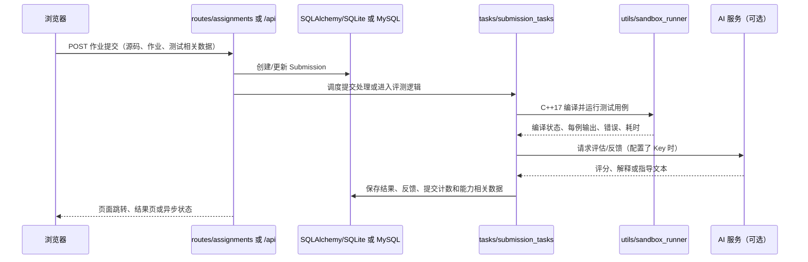

# CodeSense（酷森思）项目理解

> 阶段一接管记录：本文档基于仓库源码、现有 README、测试命名与本地运行结果整理。它只描述当前实现，不代表对未验证的线上部署行为作保证。

## 1. 项目定位

CodeSense 是面向高校编程教学的 Flask Web 平台，把 C++ 作业提交、测试执行、AI 辅导、阶段式学习记录和教师侧学情分析放在同一条链路中。学生侧重点是“提交—反馈—修正—解释”，教师侧重点是作业、班级、提交记录和能力趋势管理。

项目的核心产品判断是：评测结果不仅用于判定对错，也用于驱动启发式指导和学习画像。AI 是可选服务，代码执行与数据库记录仍是主要业务事实来源。

## 2. 主要目录与模块

| 路径 | 职责 | 关键入口 |
| --- | --- | --- |
| `app.py` | Flask 应用创建、配置加载、扩展初始化、蓝图注册、日志与任务启动 | `create_app()` |
| `config.py` | development/testing/production 配置；数据库 URI 和密钥来自环境变量 | `config` |
| `models.py` | SQLAlchemy 模型、关系和部分统计/初始化逻辑 | `db`、`init_db()` |
| `routes/` | 页面和 API 蓝图：认证、作业、班级、用户、成绩、思维/阶段流程 | 各文件中的 `Blueprint` |
| `services/` | AI 客户端、演示数据隔离、课程评分、教师分析和 API Key 读取 | `llm_client.py`、`demo_database.py` |
| `utils/` | 代码执行、评测、指导、建议、异步任务、能力评分及 Markdown 处理 | `sandbox_runner.py`、`code_evaluator.py` |
| `tasks/` | 提交后处理和能力分析任务 | `submission_tasks.py` |
| `templates/` | Jinja 页面模板；`static/` 存放 JS、CSS、编辑器与图片 | 页面层 |
| `tests/` | 应用、演示体验、认证、班级/成绩、沙箱和阶段三 Agent 等测试 | pytest 测试文件 |

应用启动时在 `app.py` 注册 `auth`、`main`、`assignments`、`users`、`api`、`classes`、`thinking`、`grades` 等蓝图。默认开发数据库是项目实例目录下的 SQLite；生产配置要求显式提供 `DATABASE_URL` 和 `SECRET_KEY`。

## 3. 核心流程：学生提交 C++ 作业



源码核验点：`routes/assignments.py` 的 `submit_code()` 是页面提交入口，`routes/api.py` 提供 `/api/submit`；`tasks/submission_tasks.py` 调用 `run_test_cases()` 和 `evaluate_cpp_code()`；`utils/sandbox_runner.py` 使用临时目录、`g++ -std=c++17`、编译超时 15 秒和运行超时 5 秒，并标准化输出后比较。

控制流不是单一的“请求内同步函数”：项目同时存在路由内评测、后台线程任务和阶段式 `thinking` 流程。因此追踪一次提交时，需要同时看页面路由、任务实现和模型写入，而不能只从模板判断行为。

## 4. 本地运行与测试

### 运行

本机已发现 Conda 环境：

```powershell
conda activate codesense
cd D:\ProGram\CodeSense
python run.py
```

随后访问 `http://127.0.0.1:5000/login`。开发环境可不配置 AI Key；此时 AI 相关能力不可用，但基础页面和不依赖 AI 的功能仍可检查。C++ 评测还要求 `g++` 在 `PATH` 中。

### 测试

```powershell
conda activate codesense
python -m pytest tests -q
```

本次接管核验：`codesense` 环境为 Python 3.10.21；Flask 2.2.5、SQLAlchemy 2.0.51 可导入；`python -m py_compile app.py run.py` 通过；已启动 `python run.py`，访问 `/login` 返回 HTTP 200。尝试按 `requirements.txt` 安装时，PyPI 连接出现 `SSLEOFError`，因此没有把网络安装结果当作验证结论。

## 5. 风险与未知项

- `sandbox_runner.py` 是应用层 subprocess 隔离，不等同于面向恶意代码的完整容器/虚拟机沙箱；公网部署需要额外的权限、网络和资源隔离。
- AI 输出依赖外部服务、密钥和提示词约束；超时、异常或不可信输出可能影响反馈质量，不能替代编译测试和教师判断。
- 路由内同步评测、后台线程和 SSE/状态查询并存，生产部署下的并发、进程模型和任务丢失行为需要进一步压测确认。
- 数据库默认值、`.env`、会话目录、上传目录和演示临时数据库的生命周期依赖运行环境；多进程部署的共享存储与清理策略尚未完整核验。
- 仓库存在较多历史兼容逻辑、页面/脚本的多套编辑器实现和阶段三 Agent 代码；模块边界目前是“可运行的演进结构”，不是严格分层架构。
- 本次只完成源码理解和基础启动核验，未验证真实 MySQL、Redis、AI 账户、生产 Gunicorn 配置或 Windows `g++` 评测链路。

## 6. 我的整体理解

CodeSense 本质上是一个以提交记录为主线的教学工作台：`Submission` 和评测证据把学生行为沉淀下来，阶段式流程把“写代码”扩展为“描述思路、构造步骤、解释原理”，教师分析再把这些记录聚合成班级和能力视图。Flask 蓝图承担入口编排，SQLAlchemy 模型承担状态持久化，`utils` 和 `services` 承担评测/AI/分析能力。

当前最重要的系统边界是三者之间的可信度：代码执行结果是较硬的事实，数据库中的学习记录是业务状态，AI 文本是带不确定性的辅助解释。后续接管应优先围绕这条边界补充运行观测、任务一致性和沙箱隔离验证，而不是先扩大业务功能。

