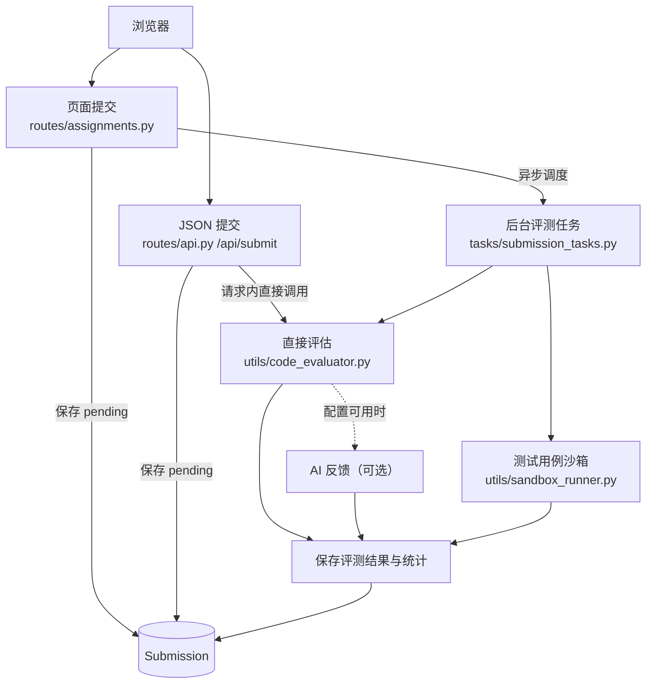

# CodeSense（酷森思）项目理解

> 阶段一接管记录：本文档基于仓库源码、现有 README、测试命名与本地运行结果整理。它只描述当前实现，不代表对未验证的线上部署行为作保证。

## PR 说明与复核范围

### 使用的 AI 工具

本次接管使用 AI 辅助进行目录检索、源码定位、流程归纳和文档校对；所有关键结论均回到仓库源码和本地命令结果核验。未使用 AI 生成或提交任何 API Key、Token、密码、数据库凭据或内部链接。AI 辅助分析不替代代码执行、测试或人工复核。

### 阅读范围

重点阅读和交叉核对了：`app.py` 的 `create_app()`、`config.py` 的环境配置、`models.py` 的数据库模型入口、`routes/assignments.py` 的 `submit_code()`、`routes/api.py` 的 `submit_code()`、`tasks/submission_tasks.py` 的 `evaluate_submission_async()`、`utils/code_evaluator.py` 的 `evaluate_cpp_code()`、`utils/sandbox_runner.py` 的 `run_test_cases()`，以及 `services/`、`utils/agents/`、`tasks/`、`templates/`、`static/` 和 `tests/` 的目录结构与相关测试命名。阅读范围以理解主流程和风险边界为目的，并非逐行审计全部文件。

### 本 PR 的变更边界

本 PR 只新增本项目理解文档和其中的 Mermaid 图示，不新增业务功能、不修改线上配置、不调整依赖，也不包含真实凭据。`docs/` 被仓库忽略规则覆盖，因此提交文档时使用了显式的 `git add -f docs/project-understanding.md`。

## 1. 项目定位

CodeSense 是面向高校编程教学的 Flask Web 平台，把 C++ 作业提交、测试执行、AI 辅导、阶段式学习记录和教师侧学情分析放在同一条链路中。学生侧重点是“提交—反馈—修正—解释”，教师侧重点是作业、班级、提交记录和能力趋势管理。

项目的核心产品判断是：评测结果不仅用于判定对错，也用于驱动启发式指导和学习画像。AI 是可选服务，代码执行与数据库记录仍是主要业务事实来源。

## 2. 主要目录与模块

| 路径 | 职责 | 关键入口 |
| --- | --- | --- |
| `app.py` | Flask 应用创建、配置加载、扩展初始化、蓝图注册、日志与任务启动 | `create_app()` |
| `config.py` | development/testing/production 配置；数据库 URI 和密钥来自环境变量 | `config` |
| `models.py` | SQLAlchemy 模型、关系和部分统计/初始化逻辑 | `db`、`init_db()` |
| `routes/` | 页面和 API 蓝图：认证、作业、班级、用户、成绩、思维/阶段流程 | 各文件中的 `Blueprint` |
| `services/` | AI 客户端、演示数据隔离、课程评分、教师分析和 API Key 读取 | `llm_client.py`、`demo_database.py` |
| `utils/` | 代码执行、评测、指导、建议、异步任务、能力评分及 Markdown 处理 | `sandbox_runner.py`、`code_evaluator.py` |
| `tasks/` | 提交后处理和能力分析任务 | `submission_tasks.py` |
| `forms.py` | Flask-WTF 表单定义和输入校验 | 登录、作业、提交等表单 |
| `templates/` | Jinja 页面模板；`templates/components/` 提供可复用编辑器组件 | 页面层 |
| `static/` | CSS、图片和前端 JavaScript；`static/js/` 负责编辑器、提交和阶段式学习交互 | 浏览器交互层 |
| `tests/` | 应用、演示体验、认证、班级/成绩、沙箱和阶段三 Agent 等测试 | pytest 测试文件 |

应用启动时在 `app.py` 注册 `auth`、`main`、`assignments`、`users`、`api`、`classes`、`thinking`、`grades` 等蓝图。默认开发数据库是项目实例目录下的 SQLite；生产配置要求显式提供 `DATABASE_URL` 和 `SECRET_KEY`。

## 3. 核心流程：学生提交 C++ 作业



源码核验点：`routes/assignments.py` 的 `submit_code()` 先保存 `pending` 提交，再调用 `evaluate_submission_async()`，由 `tasks/submission_tasks.py` 执行 AI 评估和 `run_test_cases()`；`routes/api.py` 的 `/api/submit` 则在请求内直接调用 `evaluate_cpp_code()`，随后触发能力分析。因此两条提交路径不能简单视为同一条异步链路。`utils/sandbox_runner.py` 使用临时目录、`g++ -std=c++17`、编译超时 15 秒和运行超时 5 秒，并标准化输出后比较。

AI 服务不是评测事实的唯一来源：`evaluate_cpp_code()` 在 AI 不可用或调用异常时通常会回退到启发式评分或通用反馈；异步任务对公开演示会话捕获到的评测异常则会显式标记失败，避免把任务异常伪装成成功。具体行为取决于调用路径、演示会话标识和当前配置，不能把 AI 返回文本当作程序正确性的证明。

## 4. 本地运行与测试

### 运行

本机已发现 Conda 环境：

```powershell
conda activate codesense
cd <仓库根目录>
python run.py
```

运行前需要先准备名为 `codesense` 的 Conda 环境，并在项目仓库根目录执行命令。随后访问 `http://127.0.0.1:5000/login`。开发环境可不配置 AI Key；此时 AI 相关能力不可用，但基础页面和不依赖 AI 的功能仍可检查。C++ 评测还要求 `g++` 在 `PATH` 中。

### 测试

```powershell
conda activate codesense
python -m pytest tests -q
```

本次接管核验分为以下几类：

- 已执行：`codesense` 环境中的 Python 版本检查，结果为 Python 3.10.21。
- 已执行：导入 Flask 2.2.5 和 SQLAlchemy 2.0.51。
- 已执行：`python -m py_compile app.py run.py routes/api.py routes/assignments.py tasks/submission_tasks.py utils/sandbox_runner.py`，通过。
- 已执行：启动 `python run.py`，访问 `/login`，返回 HTTP 200。
- 未执行：完整 pytest；当前 Conda 环境没有安装 `pytest`，通过 PyPI 安装时出现 `SSLEOFError`。
- 未执行：真实 MySQL、Redis、AI 服务和 C++ 编译评测链路；其中 C++ 评测还需要确认 Windows 的 `g++` 配置。

### 验证限制记录

尝试安装测试依赖的命令为：

```powershell
conda activate codesense
python -m pip install -r requirements.txt
```

该命令因访问 PyPI 时出现 `SSLEOFError` 失败；随后执行 `python -m pytest tests/test_app.py -q`，结果为 `No module named pytest`。因此本 PR 不宣称 pytest 测试通过，只报告已完成的语法检查、依赖导入检查和 `/login` 启动检查。此前尝试通过 GitHub CLI 创建 PR 时还发现本机没有 `gh` 命令；PR #8 的后续推送需由已认证的 Git 客户端完成。

## 5. 风险与未知项

- `sandbox_runner.py` 是应用层 subprocess 隔离，不等同于面向恶意代码的完整容器/虚拟机沙箱；公网部署需要额外的权限、网络和资源隔离。
- AI 输出依赖外部服务、密钥和提示词约束；超时、异常或不可信输出可能影响反馈质量，不能替代编译测试和教师判断。
- 路由内同步评测、后台线程和 SSE/状态查询并存，生产部署下的并发、进程模型和任务丢失行为需要进一步压测确认。
- 数据库默认值、`.env`、会话目录、上传目录和演示临时数据库的生命周期依赖运行环境；多进程部署的共享存储与清理策略尚未完整核验。
- 仓库存在较多历史兼容逻辑、页面/脚本的多套编辑器实现和阶段三 Agent 代码；模块边界目前是“可运行的演进结构”，不是严格分层架构。
- 本次只完成源码理解和基础启动核验，未验证真实 MySQL、Redis、AI 账户、生产 Gunicorn 配置或 Windows `g++` 评测链路。

## 6. 我的整体理解

CodeSense 本质上是一个以提交记录为主线的教学工作台：`Submission` 和评测证据把学生行为沉淀下来，阶段式流程把“写代码”扩展为“描述思路、构造步骤、解释原理”，教师分析再把这些记录聚合成班级和能力视图。Flask 蓝图承担入口编排，SQLAlchemy 模型承担状态持久化，`utils` 和 `services` 承担评测/AI/分析能力。

当前最重要的系统边界是三者之间的可信度：代码执行结果是较硬的事实，数据库中的学习记录是业务状态，AI 文本是带不确定性的辅助解释。后续接管应优先围绕这条边界补充运行观测、任务一致性和沙箱隔离验证，而不是先扩大业务功能。
