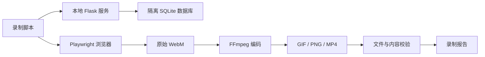

# CodeSense 答辩核心功能 GIF 自动录制方案

## 1. 目标

为 CodeSense 的项目答辩准备一套可重复生成的界面演示素材。录制过程在本地完成，使用固定账号和固定演示数据，通过 Playwright 自动操作页面，再用 FFmpeg 输出 GIF、MP4、首帧 PNG 和录制报告。

这套方案需要覆盖学生端、教师端、能力评测、风险提示和长页面可视化巡览。页面或测试数据发生变化后，可以按编号重新录制单条素材。

## 2. 范围

### 2.1 包含内容

- 学生端和教师端的核心答辩流程。
- 学生能力评测中的知识点雷达图、分析进度和个性化分析。
- 教师端的重点关注项、AI 教学建议、班级图表和学生风险标签。
- 个人统计页、教师首页、班级详情页的纵向巡览 GIF。
- 本地隔离数据库、固定测试账号和可重复的演示数据。
- GIF、MP4、PNG、JSON 元数据和录制报告。

### 2.2 不包含内容

- 不录制生产环境或真实用户数据。
- 不把所有普通页面都制作成 GIF。
- 不改变 CodeSense 的业务规则和正式用户流程。
- 不把 GIF 录制脚本当作完整的端到端测试套件。

## 3. 答辩素材清单

完整素材包生成 14 条 GIF。答辩 PPT 可以从中选择 6–8 条作为主线，其余作为备用或补充页。

| 编号 | 角色 | 页面或入口 | 演示内容 | 类型 |
|---|---|---|---|---|
| S01 | 学生 | `/login` | 登录并进入学生首页 | 操作型 |
| S02 | 学生 | `/home`、`/student_assignments` | 查看课程和作业，进入作业详情 | 操作型 |
| S03 | 学生 | `/submit/<assignment_id>` | 编辑代码、提交作业、显示评测状态 | 操作型 |
| S04 | 学生 | `/view_submission/<submission_id>` | 查看运行结果、错误信息和 AI 反馈 | 操作型 |
| S05 | 学生 | `/thinking/<assignment_id>` | 第一阶段：填写算法思路并提交 | 操作型 |
| S06 | 学生 | `/thinking/<assignment_id>` | 第二阶段：选择代码步骤并验证顺序 | 操作型 |
| S07 | 学生 | `/thinking/<assignment_id>` | 第三阶段：AI 对话、解释代码并修复问题 | 操作型 |
| S08 | 学生 | `/home` | 分析进度、知识点雷达图和 AI 个性化分析 | 操作型 |
| S09 | 学生 | `/profile#statistics` | 从个人数据滑到能力柱状图和提交趋势图 | 纵向巡览 |
| T01 | 教师 | `/teacher_dashboard` | 查看“今日需要关注”，打开重点学生详情 | 操作型 |
| T02 | 教师 | `/teacher_dashboard` | 从页首滑到页尾，浏览关注项、AI 建议和班级图表 | 纵向巡览 |
| T03 | 教师 | `/teacher/ai_suggestions` | 生成或查看 AI 教学建议 | 操作型 |
| T04 | 教师 | `/classes/<class_id>` | 从班级概况滑到学生名单、分数和风险标签 | 纵向巡览 |
| T05 | 教师 | `/view_submission/<submission_id>` | 查看学生代码、评测结果和反馈 | 操作型 |

S08 使用学生首页现有的知识点画像和 AI 分析区域。T01 使用教师首页现有的未提交、低分、长期未活跃和未注册名单提示。T04 使用班级详情页已有的状态、分数、提交次数和风险标签表格。

## 4. 总体架构



实现语言使用 Python，以便和当前 Flask 项目共用配置、脚本和测试工具。Playwright 负责登录、点击、输入、提交、滚动和录屏；FFmpeg 只负责转码和压缩，不参与页面操作。

## 5. 两种录制模式

### 5.1 操作型 GIF

每条流程从干净的浏览器上下文开始，按固定步骤完成一个功能。动作之间使用页面状态等待，不依赖长时间固定睡眠。

示例：S08 的流程为：

1. 以学生账号进入 `/home`。
2. 等待知识点雷达图的 `canvas` 完成绘制。
3. 等待能力分析进度条出现并完成。
4. 等待 AI 分析区域出现可读文本。
5. 依次停留在雷达图、分析进度和建议区。
6. 结束录制并输出素材。

### 5.2 纵向巡览 GIF

用于替代静态长截图。浏览器视口保持固定，页面从顶部开始，每次向下滚动半个到一个屏幕，滚动后停留一小段时间。

统一节奏为：

```text
顶部停留约 0.8 秒
平滑滚动一个区块
区块停留约 0.8 秒
重复到页尾
页尾停留约 1 秒
```

巡览脚本必须检查最终 `scrollTop` 已接近页面总高度，不能因为页面尚未加载完成而提前结束。

## 6. 本地数据和环境隔离

录制使用 `CAPTURE_MODE=1` 或等效的测试配置，数据库指向一次性创建的 SQLite 文件。每次完整录制前先清空并重新写入演示数据，避免上一次录制产生的提交或状态影响下一次结果。

固定数据至少包括：

- 一个学生账号和一个教师账号。
- 一个教师管理的示例班级。
- 一条可提交的 C 语言作业。
- 若干学生、提交记录和评测结果。
- 学生能力评分、班级平均值和提交趋势。
- 未提交、低分、长期未活跃、未注册等教师端风险状态。
- 已完成的 AI 分析和教学建议示例。

S08 的 SSE 分析、T03 的 AI 建议和其他需要异步结果的页面使用本地固定响应。录制不依赖外部大模型接口、真实数据库或网络速度。

当前模板使用 Chart.js、marked 等前端依赖。录制环境必须使用本地文件或预先缓存的依赖；如果依赖无法加载，脚本直接失败，不允许静默录出空白图表。

## 7. 录制规格

- 浏览器：Chromium。
- 视口：`1280×720`，16:9。
- 原始录制：Playwright 输出的 30 FPS WebM。
- GIF 主规格：12 FPS、`1120×630`，使用调色板压缩。
- 如果 GIF 超过 8 MB，自动降为 `960×540` 并在报告中标记压缩降级。
- 操作型 GIF：5–8 秒。
- 纵向巡览 GIF：8–12 秒。
- 页面顶部和底部各保留约 1 秒静止画面。
- 保留鼠标指针和右侧滚动条，不录制浏览器地址栏和系统窗口。
- 不录制声音。

输出文件使用稳定名称，不把日期写进主文件名：

```text
S08-ability-analysis.gif
S08-ability-analysis.mp4
S08-ability-analysis.png
S08-ability-analysis.json
```

PNG 是 GIF 无法播放时的静态兜底图，JSON 记录页面、角色、演示数据版本、录制参数、脚本版本和生成时间。

## 8. 项目文件组织

录制脚本放在源码仓库，生成素材放在工作区输出目录：

```text
E:\CodeSense\源代码\scripts\demo_capture\
├─ manifest.yaml
├─ runner.py
├─ flows\
│  ├─ student_flows.py
│  └─ teacher_flows.py
├─ fixtures\
│  ├─ student_demo.json
│  └─ teacher_demo.json
├─ encoder.py
├─ validator.py
└─ README.md

E:\CodeSense\outputs\codesense-defense-gifs\
├─ gif\
│  ├─ student\
│  └─ teacher\
├─ mp4\
├─ poster\
├─ raw\
└─ reports\
```

`manifest.yaml` 是单条素材的入口，至少记录以下字段：

- `id`：例如 `S08`、`T04`。
- `role`：`student` 或 `teacher`。
- `route`：起始页面。
- `mode`：`interaction` 或 `page_tour`。
- `fixture`：使用的演示数据名称。
- `actions`：点击、输入、提交或滚动步骤。
- `ready`：页面完成条件。
- `output`：输出文件名。

建议支持以下命令：

```bash
python scripts/demo_capture/runner.py --all
python scripts/demo_capture/runner.py --id S08
python scripts/demo_capture/runner.py --id T01,T02,T04
python scripts/demo_capture/runner.py --role student
```

## 9. 页面等待和定位

优先使用页面已有的稳定 ID、语义角色、按钮文本和链接目标。能力评测可使用 `#knowledgeRadarChart`、`#analysis-progress`、`#analysis-status-badge` 等已有元素；班级风险表可使用风险标签容器和“查看详情”按钮定位。

如果现有选择器不足，只增加少量 `data-capture` 标记，不改变页面展示和业务逻辑。每个流程都要定义明确的完成条件，例如：

- URL 已切换到目标页面。
- 主标题已出现。
- 图表 `canvas` 已存在且宽高大于 0。
- 分析状态已从加载中变为完成。
- 风险表至少出现一条演示数据。
- 页面滚动位置已到达页尾。

## 10. 失败处理与校验

以下情况不生成成品 GIF，并写入失败报告：

- 登录失败或角色错误。
- 演示数据为空。
- 图表没有绘制。
- AI 分析或教学建议仍处于加载状态。
- 教师风险列表为空。
- 页面没有滚动到页尾。
- 页面控制台出现未处理异常。
- 输出尺寸、时长或文件大小超出限制。

失败时保留页面截图、HTML、控制台日志、原始视频和当前素材编号，方便定位问题。

校验器至少检查：

- 文件是否存在且可以被 FFmpeg 读取。
- 画幅是否为 16:9。
- 时长是否符合对应模式。
- GIF 是否至少包含多个有效帧。
- GIF 是否超过答辩素材的文件大小上限。
- S08 是否包含雷达图和分析结果。
- T01 和 T04 是否包含风险或重点关注信息。
- 纵向巡览是否同时覆盖页面顶部和底部。

## 11. 验收标准

执行以下命令后，14 条素材全部生成并通过校验：

```bash
python scripts/demo_capture/runner.py --all
```

验收结果需要满足：

1. 本地无外部 API 依赖时可以完成录制。
2. 学生端和教师端账号不会串用。
3. 学生能力评测能看到雷达图、进度和 AI 分析结果。
4. 教师端能看到未提交、低分或长期未活跃等重点关注项。
5. 个人统计页、教师首页和班级详情页能从页首滑到页尾。
6. 每条素材都生成 GIF、MP4、PNG 和 JSON 元数据。
7. 失败素材不会被当成成功结果写入输出目录。
8. 使用相同固定数据重复录制时，主要文案、图表和状态保持一致。

## 12. 实施边界

实现阶段只增加录制脚本、测试数据、测试配置、必要的稳定定位标记和转码校验工具。正式页面只做保证演示可重放所需的最小改动，不借机重构业务模块或调整现有视觉设计。
